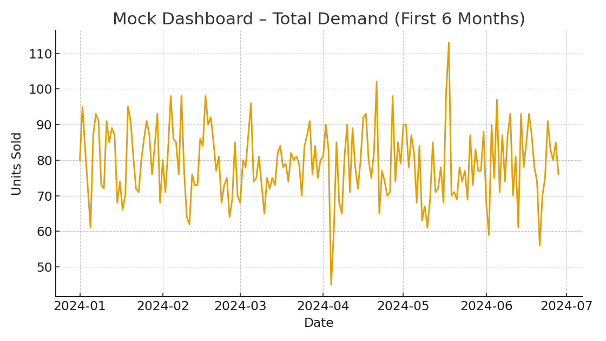

# Demand Forecasting & Inventory Simulation

### Sample Dashboard Visual

## Business Impact (sample)
- Improves forecast accuracy and reduces stockouts/expedites through proactive planning.
- Lowers working capital via right-sized inventory and safety-stock targets.
- Reduces supplier-driven delays by surfacing risk early and segmenting actions with the Kraljic Matrix.
- Cuts route miles and delivery time with optimised VRP heuristics.
